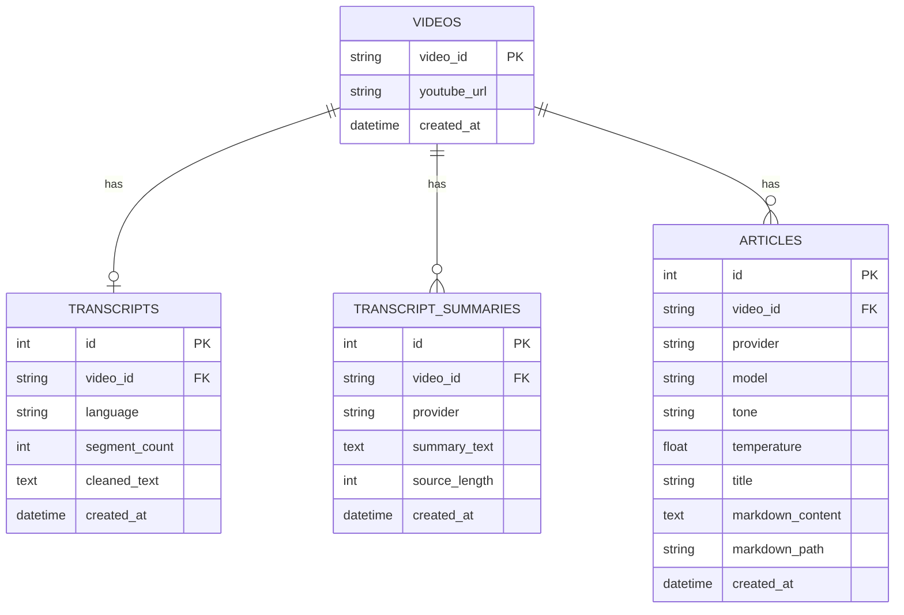

# YouTube Transcript to Article

## 📖 Overview
This project converts YouTube videos into structured, high-quality articles through a modular processing pipeline. It demonstrates an extensible, production-ready architecture featuring multi-provider support, intelligent caching, and a containerized full-stack environment.

**Live Demo:** https://youtube-to-article-main.fly.dev/

## Demo

Watch the demo video:

https://drive.google.com/file/d/1hjeHz_iOQpm6C1TGhThyDDJ25iQk0KWa/view?usp=sharing

### ⚙️ The Pipeline
1.  **Ingestion:** Extract video ID from URL.
2.  **Extraction:** Fetch and normalize the raw transcript.
3.  **Processing:** (Optional) Chunk long transcripts and generate neutral summaries.
4.  **Synthesis:** Generate a formatted article based on selected provider, model, and tone.
5.  **Persistence:** Cache results in SQLite and save Markdown outputs locally.

---

## ✨ Features
* **Multi-Provider Support:** Seamlessly switch between `OpenAI` and `Gemini`.
* **Granular Control:** Select provider, model, and tone dynamically
* **Optimization:** Smart caching avoids redundant API calls and re-summarization.
* **Long-Form Support:** Automated chunking for long transcripts.
* **Real-time UX:** Streaming article generation for immediate feedback.
* **Production-Ready:** SQLite persistence and full Dockerization.

---

## 🏗️ Architecture
The system is decoupled into two primary layers:

* **Backend (FastAPI):** Handles transcript processing, LLM abstraction, summarization logic, and database persistence.
* **Frontend (React/Vite):** A clean UI for parameter selection (URL, provider, model, tone) and rendered Markdown output.

---

## 🚀 Local Development

### Backend
```bash
cd backend
cp .env.example .env
# Setup environment and install dependencies
python -m venv .venv
source .venv/bin/activate # or .venv\Scripts\activate on Windows
pip install -r requirements.txt
uvicorn app.main:app --reload
```
*Note: At least one provider key is required. The app will run with either OpenAI or Gemini configured.*

### Frontend
```bash
cd frontend
cp .env.example .env
npm install
npm run dev
```

### 🐳 Docker Deployment
Run the entire stack with a single command:
```bash
docker compose up --build
```
* **Frontend:** `http://localhost:5173`
* **Backend API:** `http://localhost:8000`
* **Interactive Docs:** `http://localhost:8000/docs`

---

Before running the Docker setup:

- Make sure `backend/.env` exists and is created from `backend/.env.example`
- Use `http://localhost:5173` for the frontend
- Do not mix backend-only Docker commands with `docker compose up --build`
  
## 📊 Database Schema


---

## 🧠 Design Decisions
1.  **Transcript-First Architecture:** The cleaned transcript serves as the single source of truth for all downstream tasks.
2.  **Summary Caching:** For long inputs, a neutral summary is generated and cached per provider. This reduces latency and token costs when regenerating the same video in different tones.
3.  **Article Variants:** The system supports multiple "views" of the same data, allowing users to compare outputs across different models or temperatures.
4.  **Markdown-Centric Output:** Articles are persisted as clean `.md` files, ensuring they are portable and ready for CMS or static site integration.

---

## 📝 Assignment Context
This project was developed as a technical assessment to demonstrate the ability to move from a basic script to a robust, extensible system. 

**Key Enhancements included:**
* Advanced provider abstraction.
* Intelligent handling of LLM context limits via chunking.
* Full persistence layer (SQL + Filesystem).
* Modern, containerized developer experience.

---

## 🚀 Final Note

This project focuses on building a simple idea the right way — with clarity, scalability, and thoughtful tradeoffs.
